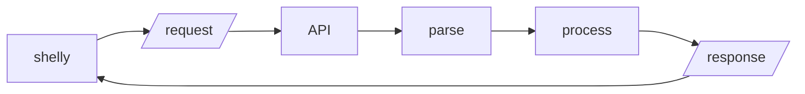

# shelly


A pure and vanilla shell-like interface for the web.

## Installation


1. Get shelly from the releases page or clone this repository;
2. Edit [public/src/config.js.dist](public/src/config.js.dist), set the right configuration values and edit the MOTD message;
3. Save [public/src/config.js.dist](public/src/config.js.dist) as public/src/config.js;
4. Add the CSS and JS files to your HTML document:

```html
<link rel="stylesheet" href="style/shelly.css">
<script type="text/javascript" src="src/config.js"></script>
<script type="text/javascript" src="src/shelly.js"></script>
``` 

shelly will automatically append it's elements to your HTML document's `body`.

## Usage



shelly can work with any HTTP backend, running on the same machine or via CORS. It transmits user input via a HTTP header called `SHELLY-INPUT`.

If you provide a function named `processResponse`, shelly will automatically pass the response object to it. It will, otherwise:

* Work with the main content of the response object as a `response` attribute, e.g. `data.response`;
* Insert that response as HTML if the `Content-Type` response header includes `text/html`;
* Insert that response as text otherwise.

The server should implement:

* A parser to break the input betwwen command, sub-command, flags, parameters, etc...
* Validation
* The processing and response of each command.

I'll soon publish an example implementation and will then link it here.

