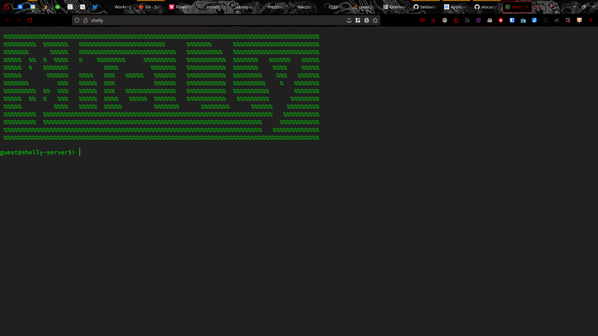
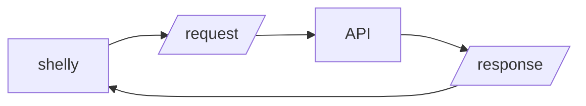

# shelly


A shell-like interface for the web written entirely in HTML, CSS and JavaScript (ES6).

- [shelly](#shelly)
  - [Installation](#installation)
  - [Usage](#usage)
    - [shelly's expected flow (simplified):](#shellys-expected-flow-simplified)
  - [CSRF](#csrf)
  - [Server](#server)
  - [Acknowledgements](#acknowledgements)
  - [Credits](#credits)

## Installation



1. Get shelly from the releases page or clone this repository;
2. Edit [public/src/config.js.dist](public/src/config.js.dist), set the right configuration values and edit the MOTD message (see the [wiki](https://github.com/galvao-eti/shelly/wiki) for more information);
3. Save [public/src/config.js.dist](public/src/config.js.dist) as `public/src/config.js`;
5. Add the CSS file to your HTML document:

```html
<link rel="stylesheet" href="style/shelly.css">
``` 

## Usage

Either instantiate shelly as "lazyInit" or instantiate and then initialize it.

The following is the **recommended** way of using shelly:

```html
<script type="text/javascript">
    "use strict";

    const configScript = document.createElement('script');
    const commandsScript = document.createElement('script');

    configScript.src = 'src/config.js?qs=' + Shelly.generateRandomString();
    commandsScript.src = 'src/commands.js?qs=' + Shelly.generateRandomString();

    document.body.appendChild(configScript);

    configScript.addEventListener('load', function () {
        document.body.appendChild(commandsScript);
    });

    commandsScript.addEventListener('load', function () {
        // Programmatic Initialization
        try {
            const shelly = new Shelly(shellyConfig, false);
            shelly.init();
        } catch (e) {
            console.error(e.message);
        }

        // Lazy Initialization
        try {
            const shelly2 = new Shelly(shellyConfig);
        } catch (e) {
            console.error(e.message);
        }
    });
</script>
```

shelly will then append it's elements to your HTML document's `body`.

Shelly transmits user input via a HTTP header called `SHELLY-INPUT`.

Populate shelly's `shellyCsrfToken` `meta` tag according to your anti-CSRF implementation (see [CSRF](#csrf) below);

### shelly's expected flow (simplified):



shelly can work with any HTTP backend, running on the same machine or via CORS. 

If you provide a function named `processResponse`, shelly will automatically pass the response object to it. It will, otherwise:

* Work with the main content of the response object as a `response` attribute, e.g. `data.response`;
* Insert that response as HTML if the `Content-Type` response header includes `text/html`;
* Insert that response as text otherwise.

## CSRF

It should go without saying that **no one should use shelly without, at least, CSRF protection**.

If you need more information about CSRF there's no better place than i[OWASP](https://owasp.org/www-community/attacks/csrf), of course.

Shelly expects to work with a CSRF token provided by the server. 

It's beyond of the scope of shelly to tell you how to generate and deal with the CSRF token, since there are many methods to do this.

The token should be stored in a request header called, you've guessed it, `SHELLY-CSRF-TOKEN`. That header expects it's value to be read in an `content` attribute of a `meta` tag named `shellyCsrfToken`:

```javascript
document.head.querySelector('meta[name=shellyCsrfToken]').content;
```

## Server

a.k.a "shelly-api"

The server should implement:

* CSRF prevention;
* Validation;
* A parser to break the input betwwen command, sub-command, flags, arguments, etc...
* The processing and response of each command.

I'll soon publish an example implementation and will then link it here.

## Acknowledgements

* shelly is a passion project and I dedicate it to my dear friend and master of shell [Julio Cezar Neves](https://pt.wikipedia.org/wiki/Julio_Cezar_Neves);
* shelly's logo uses [Hack Nerd Font Mono](https://github.com/ryanoasis/nerd-fonts);
* Every piece of diagram, drawing, logo, etc... was made in [inkscape](https://inkscape.org/);
* The project's main resource for documentation is, of course, [Mozilla Developer Network](https://developer.mozilla.org/en-US/).

## Credits

Created and maintained by [Er Galvão Abbott](https://github.com/galvao);
Licensed under the Apcahe License by [Galvão Desenvolvimento Ltda](https://galvao.eti.br/) - see the [License file](/LICENSE).